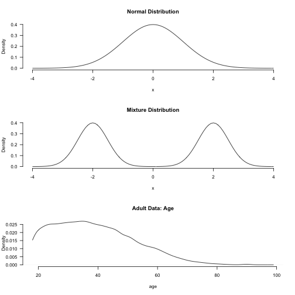
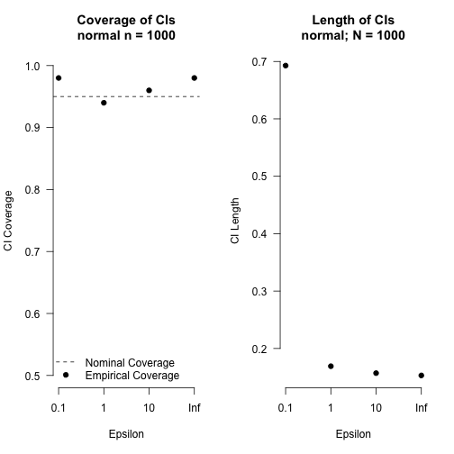
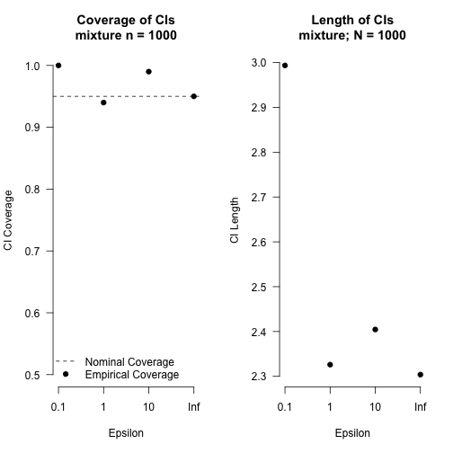
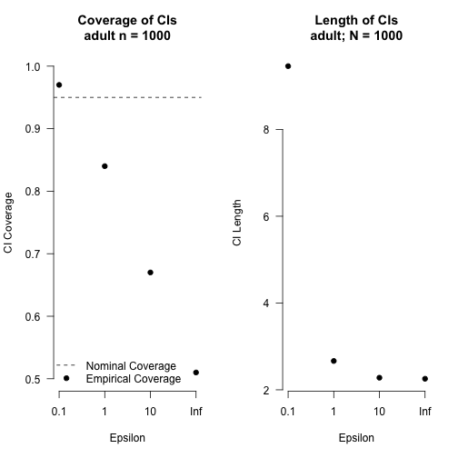
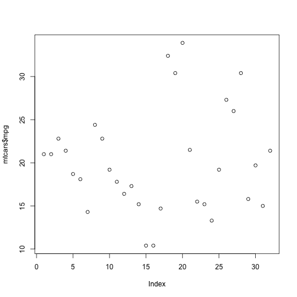

# Introduction

Here goes an introduction text

# Our proposed method
\label{sec:method}

Instead of focusing on a single quantitiy of interest we produce synthetic data in the form of a private (discretized) cumulative distribution function (cdf). The private cdf is then used draw resamples and apply the same mechanism on each of the resamples. This step does not cost any additional privacy budget as it is post-processing the private cdf. We then use the resulting distribution of cdfs calculate confidence intervals for several statistics of interest (such as quantiles, e.g. the median, the mean, the probability of observing a point in a particular region) and a confidence interval for the entire cdf.


# Related Work


# Experiments

We evaluate the performance of our proposed method in a set of experiments. First, we are interested in the validity of the generated confidence intervals. Second, we evaluate how different settings of the parameters in the algorithm ($\epsilon$, $B$, bounds, granularity) affect the resulting confidence intervals. The results show that...

*Datasets.* To understand the behavior of our method under different settings we look at several data sets. First, we look at data sets where we have full control over the data generating process: 
\begin{itemize}
\item data drawn from a standard normal distribution $\mathcal{N}(0, 1)$.
\item data drawn from a mixture of two normal distributions with equal weight $f(x) = \sum_{k=1}^K \lambda_k f_k(x)$, with $\lambda = (0.5, 0.5), f_1(x) = \mathcal{N}(-2, 0.25)$ and $f_2(x) = \mathcal{N}(2, 0.25)$. 
\item (different weights, different means, $\frac{1}{3}, \frac{2}{3}$)
\item lognormal distribution
\end{itemize}

Furthermore, we show results on real data and use the adult data set from the UCI Machine Learning Repository (\cite{Dua2019}) that is derived from 1994 census data. In particular we look at the age variable. 

Figure \ref{fig:fig1} summarizes the data sets. From each of the data sets we draw samples $\hat P$ of different sizes (50, 100, 500, 1000, 5000), to understand the behavior of our method at different sample sizes.





(Further potential real data sets: Census (ACS and/or decennial)) PUMS data from IPUMS, Census business data)

*Parameters.* In our algorithm we have several parameters that influence the results. Most importantly we vary the privacy budget $\epsilon$ (0.1, 1, 10, Inf) and the number of bootstrap iterations $B$ (1000, increase for a couple of settings). Furthermore the lower and upper bound of the cdf algorithm as well as the granularity parameter play an important role and poorly set may bias results. For the known data generating processes (normal, mixture) we set the lower bound to $-4$ and the upper bound to $4$ and the granularity parameter to $0.01$. 
For the adult data we set the lower bound to $18$ and the upper bound to $99$ with a granularity of $0.1$. (Other sets, how to choose them?)

*Evaluation.* To understand the performance of our method we repeatedly (100 times) apply the method to fresh samples $\hat P$ from the population data $P$. For each sample $\hat P$ we produce confidence intervals and calculate the proportion of confidence intervals that cover the true population value (empirical coverage). Furthermore, we are interested in the length of the confidence intervals (shorter intervals with coverage close to the nominal coverage are better).

In the case of samples from the known data generating process we can compare the resulting confidence intervals to the true population values. For the adult data set (and other real data sets) we consider the full data set as our ground truth and take simple random samples from it to evaluate our proposed method. We consider the statistic of interest calculated on the entire data set as our ground truth.

*Statistics of interest.* Median, mean, some percentile $\frac{1}{3}$, entire cdf --> CI around it!

# Results

(Ratio of length to non-private one, IQR of actual distribution)

(Results to record. Bootstrap distributions, Profiling of code, Parallelization of code? )

(Combinations of parameters, other methods to get CIs, explain that pivot doesn't work in some cases and show it. True value from discretized data.)









# Notes

Different possibilities to get quantiles. So far we used the percentile method.

The range and granularity need to be set properly (how?), otherwise truncation and (too coarse) discretization can bias results.


\newpage
# Instructions

You can use directly LaTeX command or Markdown text. 

LaTeX command can be used to reference other section. See Section \ref{sec:headings}.
However, you can also use **bookdown** extensions mechanism for this.


## Headings: second level

You can use equation in blocks

$$
\xi _{ij}(t)=P(x_{t}=i,x_{t+1}=j|y,v,w;\theta)= {\frac {\alpha _{i}(t)a^{w_t}_{ij}\beta _{j}(t+1)b^{v_{t+1}}_{j}(y_{t+1})}{\sum _{i=1}^{N} \sum _{j=1}^{N} \alpha _{i}(t)a^{w_t}_{ij}\beta _{j}(t+1)b^{v_{t+1}}_{j}(y_{t+1})}}
$$

But also inline i.e $z=x+y$

### Headings: third level

Another paragraph. 


# Examples of citations, figures, tables, references
\label{sec:others}

You can insert references. Here is some text [@kour2014real; @kour2014fast] and see @hadash2018estimate.

The documentation for \verb+natbib+ may be found at

You can use custom blocks with LaTeX support from **rmarkdown** to create environment.

::: {.center latex=true}
  <http://mirrors.ctan.org/macros/latex/contrib/natbib/natnotes.pdf}>
:::

Of note is the command \verb+\citet+, which produces citations
appropriate for use in inline text.  

You can insert LaTeX environment directly too.

\begin{verbatim}
   \citet{hasselmo} investigated\dots
\end{verbatim}

produces

\begin{quote}
  Hasselmo, et al.\ (1995) investigated\dots
\end{quote}

\begin{center}
  \url{https://www.ctan.org/pkg/booktabs}
\end{center}


## Figures

You can insert figure using LaTeX directly. 

See Figure \ref{fig:fig1}. Here is how you add footnotes. [^Sample of the first footnote.]

\begin{figure}
  \centering
  \fbox{\rule[-.5cm]{4cm}{4cm} \rule[-.5cm]{4cm}{0cm}}
  \caption{Sample figure caption.}
  \label{fig:fig3}
\end{figure}

But you can also do that using R.


```r
plot(mtcars$mpg)
```



You can use **bookdown** to allow references for Tables and Figures.


## Tables

Below we can see how to use tables. 

See awesome Table~\ref{tab:table} which is written directly in LaTeX in source Rmd file.

\begin{table}
 \caption{Sample table title}
  \centering
  \begin{tabular}{lll}
    \toprule
    \multicolumn{2}{c}{Part}                   \\
    \cmidrule(r){1-2}
    Name     & Description     & Size ($\mu$m) \\
    \midrule
    Dendrite & Input terminal  & $\sim$100     \\
    Axon     & Output terminal & $\sim$10      \\
    Soma     & Cell body       & up to $10^6$  \\
    \bottomrule
  \end{tabular}
  \label{tab:table}
\end{table}

You can also use R code for that.


```r
knitr::kable(head(mtcars), caption = "Head of mtcars table")
```


Table: Head of mtcars table

|                  |  mpg| cyl| disp|  hp| drat|    wt|  qsec| vs| am| gear| carb|
|:-----------------|----:|---:|----:|---:|----:|-----:|-----:|--:|--:|----:|----:|
|Mazda RX4         | 21.0|   6|  160| 110| 3.90| 2.620| 16.46|  0|  1|    4|    4|
|Mazda RX4 Wag     | 21.0|   6|  160| 110| 3.90| 2.875| 17.02|  0|  1|    4|    4|
|Datsun 710        | 22.8|   4|  108|  93| 3.85| 2.320| 18.61|  1|  1|    4|    1|
|Hornet 4 Drive    | 21.4|   6|  258| 110| 3.08| 3.215| 19.44|  1|  0|    3|    1|
|Hornet Sportabout | 18.7|   8|  360| 175| 3.15| 3.440| 17.02|  0|  0|    3|    2|
|Valiant           | 18.1|   6|  225| 105| 2.76| 3.460| 20.22|  1|  0|    3|    1|


## Lists

- Item 1
- Item 2 
- Item 3
